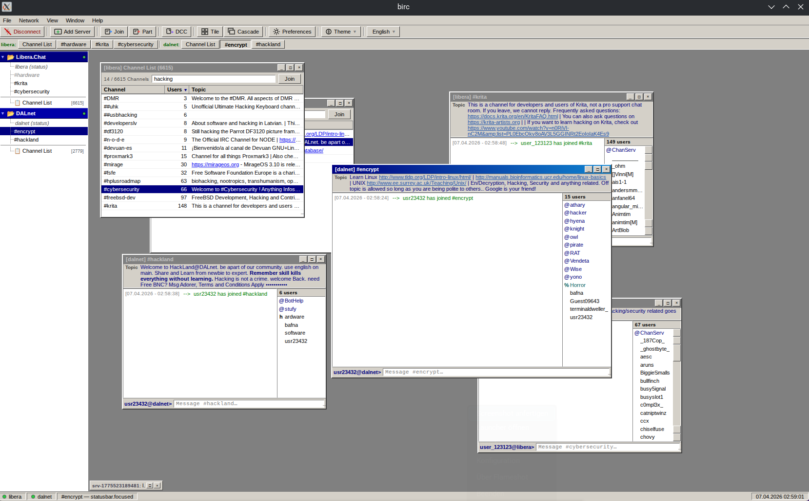
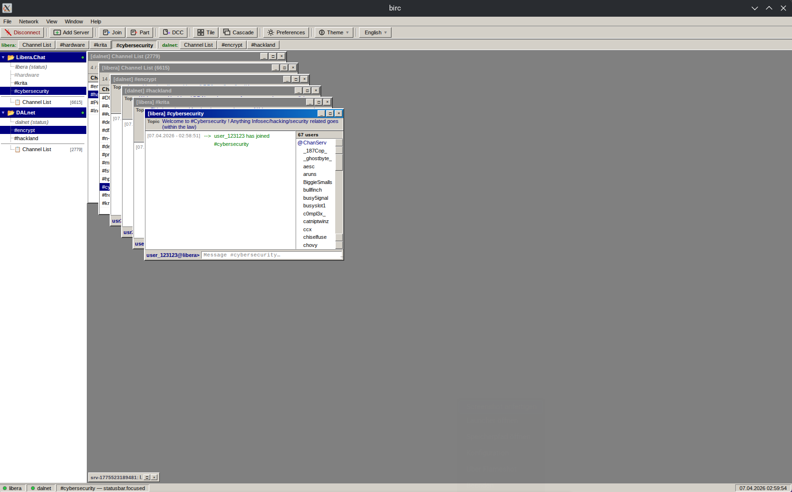
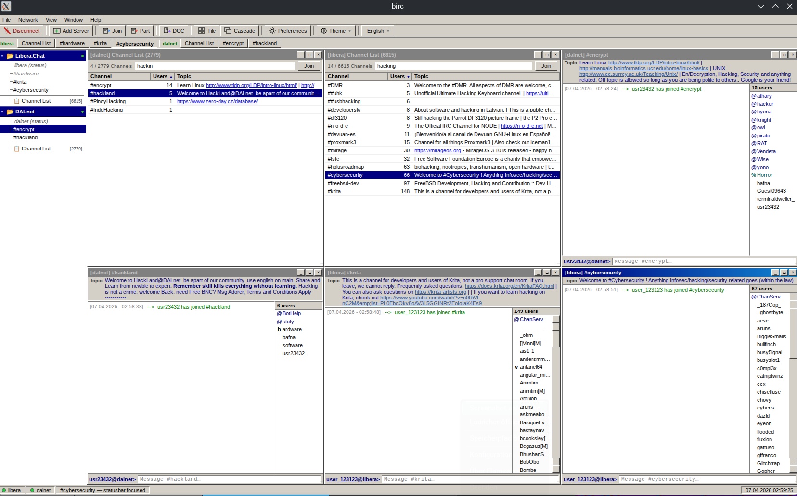
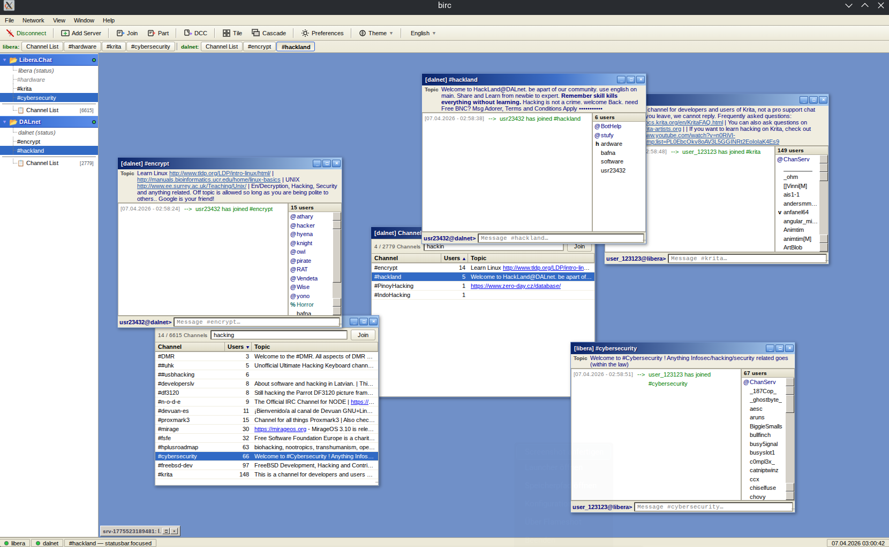
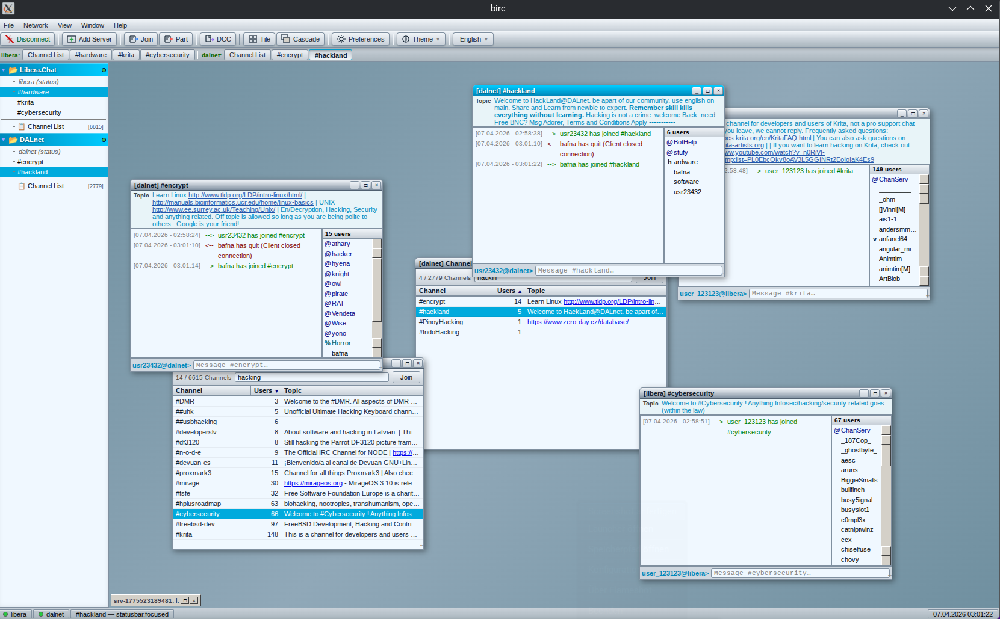
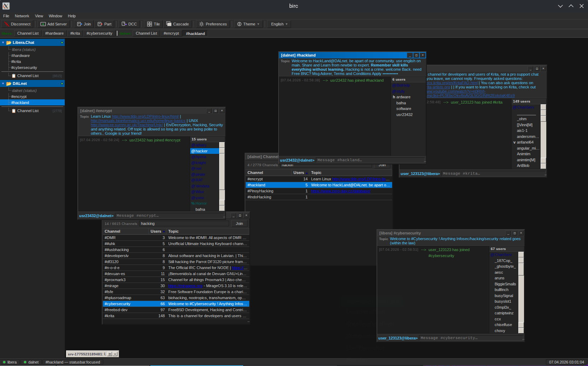
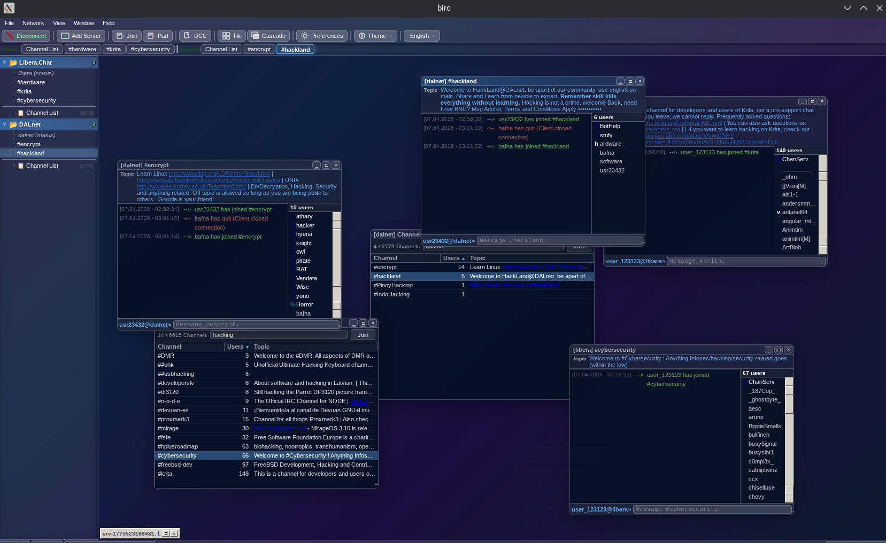

# bIRC (Alpha)

> **⚠️ Note:** This project is currently in **Alpha**. It is functional but expect bugs, breaking changes, and incomplete features. Use with caution.

Over the last 15 years, IRC has been pushed aside by centralized platforms, yet the protocol never died. In an era of corporate dominance, decentralized communication is more vital than ever.

I started **bIRC** (blackflag crew IRC client) because I noticed a lack of visually appealing, open-source IRC clients for Linux, macOS, and Windows. I build community tools to help people gather outside the corporate mainstream – starting with a client that proves decentralized chat can still look and feel great.

<div align="center">
  <table border="0">
    <tr>
      <td align="center" width="50%">
        <br/>
        <em>Origin (90s style)</em>
      </td>
      <td align="center" width="50%">
        <br/>
        <em>Origin (90s style) - Cascade</em>
      </td>
    </tr>
    <tr>
      <td align="center" width="50%">
        <br/>
        <em>Origin (90s style) - Tiled</em>
      </td>
      <td align="center" width="50%">
        <br/>
        <em>2000s style</em>
      </td>
    </tr>
    <tr>
      <td align="center" width="50%">
        <br/>
        <em>Y2K</em>
      </td>
      <td align="center" width="50%">
        <br/>
        <em>Midnight</em>
      </td>
    </tr>
    <tr>
      <td align="center" width="50%">
        <br/>
        <em>Glassmorphism (dark mode)</em>
      </td>
    </tr>
  </table>
</div>

---

## Features

- **MDI Interface** — Multiple windows, drag, resize, minimize, maximize, cascade, tile
- **Full IRC Protocol** — IRCv3, CAP negotiation, SASL PLAIN, NickServ auto-identify
- **CTCP** — Responds to VERSION, PING, TIME
- **Auto-Reconnect** — Exponential backoff, up to 10 attempts
- **Tab Completion** — Nick and command completion
- **mIRC Color Codes** — Full rendering with bold, italic, underline, reverse
- **Channel List** — `/list` with filter and sort
- **Topic Editor** — With color code toolbar and symbol picker (Op+ only)
- **Logging** — Per-channel log files, configurable path, export and delete
- **Themes** — Origin, 2000, Midnight, Y2K, Glass + custom CSS support
- **i18n** — 19 languages, auto-detected from locale files
- **Server Tree** — Win32-style tree view with context menus

---

## Known Issues


- **Logging:**  Might not work under Windows and Mac, Linux is untestet
- **DCC:** Only a dummy window pops up, issue is still not implemented

---

## Tech Stack

| Layer | Technology |
|-------|-----------|
| Frontend | Vue 3 + Pinia + vue-i18n |
| Backend | Electron 28 + Node.js |
| Build | Vite + electron-builder |
| Storage | electron-store |

---

## Getting Started

### Prerequisites

- **OS:** Windows 10+, macOS 12+, or modern Linux (for example Devuan or Artix)
- **Node.js:** 18+
- **npm:** 10+

### Install

```bash
git clone https://github.com/mtrash/birc.git
cd birc
npm install
```

### Development

```bash
npm run dev
```

### Build

```bash
# Linux (AppImage, deb and rpm)
npm run dist:linux

# Windows (NSIS Installer + Portable)
npm run dist:win

# macOS (dmg) — must be built on macOS
npm run dist:mac

# All platforms
npm run dist:all
```

Binaries land in `dist/`.

> **Linux note:** For `.deb` you need `libxcrypt-compat`, for `.rpm` you need `rpm-tools`.
> ```bash
> sudo pacman -S libxcrypt-compat rpm-tools  # Arch/Artix
> sudo apt install libxcrypt-compat rpm       # Debian/Ubuntu
> ```

> **Windows note:** Building Windows binaries from Linux requires `wine`.
> ```bash
> sudo pacman -S wine  # Arch/Artix
> ```

---

## Project Structure

```
birc/
├── electron/
│   ├── main.js
│   ├── preload.js
│   ├── irc.js
│   └── splash.html
├── src/
│   ├── App.vue
│   ├── main.js
│   ├── i18n.js
│   ├── style.css
│   ├── themes/
│   │   ├── 2000.css
│   │   ├── midnight.css
│   │   ├── y2k.css
│   │   └── glass.css
│   ├── locales/
│   │   └── (19 language files)
│   ├── stores/
│   │   └── useIRCStore.js
│   ├── composables/
│   │   ├── useIRC.js
│   │   ├── ircConnect.js
│   │   ├── useTheme.js
│   │   ├── useLogger.js
│   │   └── useCrypto.js
│   └── components/
│       ├── MenuBar.vue
│       ├── ToolBar.vue
│       ├── ServerTree.vue
│       ├── MDIContainer.vue
│       ├── MDIWindow.vue
│       ├── ChatView.vue
│       ├── ChannelBtnRow.vue
│       ├── ChannelListView.vue
│       ├── UserList.vue
│       ├── TopicBar.vue
│       ├── InputBar.vue
│       ├── StatusBar.vue
│       ├── StubBar.vue
│       ├── TitleBar.vue
│       ├── ContextMenu.vue
│       ├── DialogAddServer.vue
│       ├── DialogJoinChannel.vue
│       ├── DialogPreferences.vue
│       ├── DialogLogs.vue
│       └── DialogDCC.vue
```

---

## Themes

| Name | Description                  |
|------|------------------------------|
| **Origin** | 90s look                     |
| **2000** | 2000s look                   |
| **Midnight** | Dark theme                   |
| **Y2K** | The future is now            |
| **Glass** | Glassmorphism (dark version) |

Custom themes can be loaded via **Toolbar → Theme → Load CSS…**

---

## Logs

Logs are saved per channel per day:
```
~/birc-logs/hackint_#bfc_2026-04-04.log
```

Manage logs via **Preferences → Logging → Manage Logs…**

---

## License

MIT — do whatever you want with it.

---

*Developed with ❤️ and lots of caffeine by mtrash*
